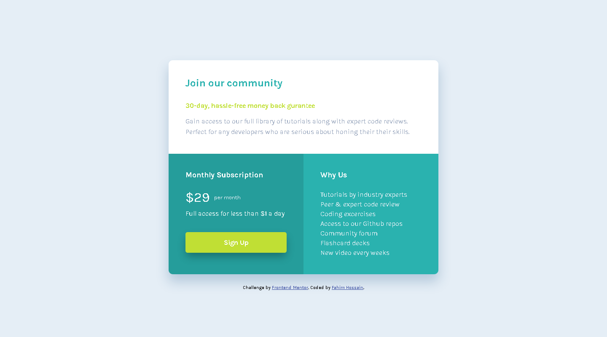

# Frontend Mentor - Single price grid component solution

This is a solution to the [Single price grid component challenge on Frontend Mentor](https://www.frontendmentor.io/challenges/single-price-grid-component-5ce41129d0ff452fec5abbbc). Frontend Mentor challenges help you improve your coding skills by building realistic projects.

## Table of contents

- [Overview](#overview)
  - [The challenge](#the-challenge)
  - [The design](#the-design)
- [What I Built](#what-i-built)
  - [Screenshots](#screenshots)
  - [Links](#links)
- [My process](#my-process)
  - [Built with](#built-with)
- [Author](#author)

## Overview

### The challenge

Users should be able to:

- View the optimal layout for the component depending on their device's screen size
- See a hover state on desktop for the Sign Up call-to-action

## The design

### Desktop design

### Mobile design

## What I Built

### Screenshots

### Desktop Preview

### Mobile Preview

### Links

- Solution URL: [Github](https://github.com/Mr-NotSoCreative/single-price-grid-component)
- Live Site URL: [live site](https://mr-notsocreative.github.io/single-price-grid-component/)

## My process

### Built with

- Semantic HTML5 markup
- CSS custom properties
- CSS Grid

## Author

- Frontend Mentor - [@Mr-NotSoCreative](https://www.frontendmentor.io/profile/Mr-NotSoCreative)
- Github - [@Mr-NotSoCreative](https://github.com/Mr-NotSoCreative)

